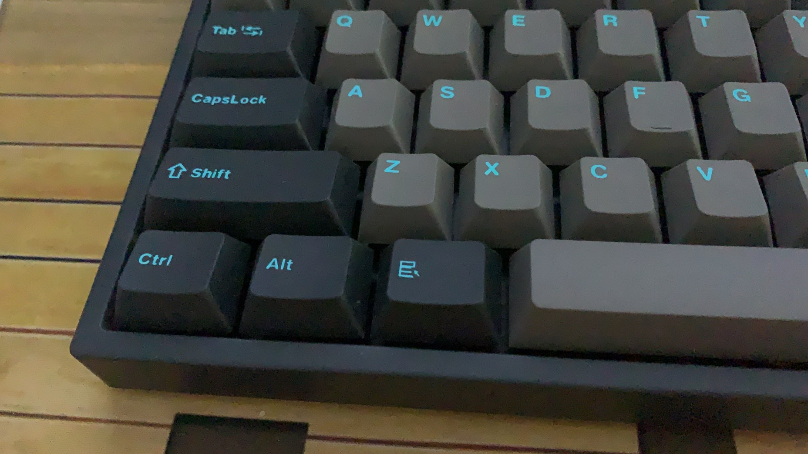

# MyHotkey

## 这是一个用来统一Windows和Mac常用快捷键的脚本，旨在Windows上获得同样的效率提升

### 使用方法

1. 使用这个脚本之前你需要下载 **autohotkey** 这个软件
2. 下载项目中的MyHotkey.ahk文件，或者直接把代码拷贝出去然后新建一个文件保存它
3. 直接运行就可以了

### 主要功能

1. 左Win改成 LAlt，原LAlt变成Command键，Win放到了原来AppsKey的位置

2. Command + 英文/数字/标点符号 = Ctrl + 英文/数字/标点符号（和Mac常用键统一）

3. 按住Ctrl的时候再按Command键 = Ctrl + Alt （保留原有Ctrl + Alt组合键功能）

4. 保留Command + Tab = 切屏

5. Command + [ = 后退（IDEA，Chrome浏览器都支持）

6. Command + ] = 前进

7. Command + 方向上 = 上一页 （同上）

8. Command + 方向下 = 下一页

9. Command + 方向左 = 光标移动到行首 （同上）

10. Command + 方向右 = 光标移动到行尾

11. Command + Shift + 方向左 = 选中到行首（同上）

12. Command + Shift + 方向右 = 选中到行尾

13. Command + 鼠标左键 = Ctrl + 鼠标左键

14. CapsLock 改成长按 = 大写， 轻按 = 切换中英文（与MacOS保持一致）

15. 屏蔽了输入法切换按键 Shift + Command

16. 屏蔽了输入法切换按键 Ctrl + Space

17. Command + Space = Alt + Space

### 特殊说明

你也可以更改键帽获得外观上的一致性体验（逃

